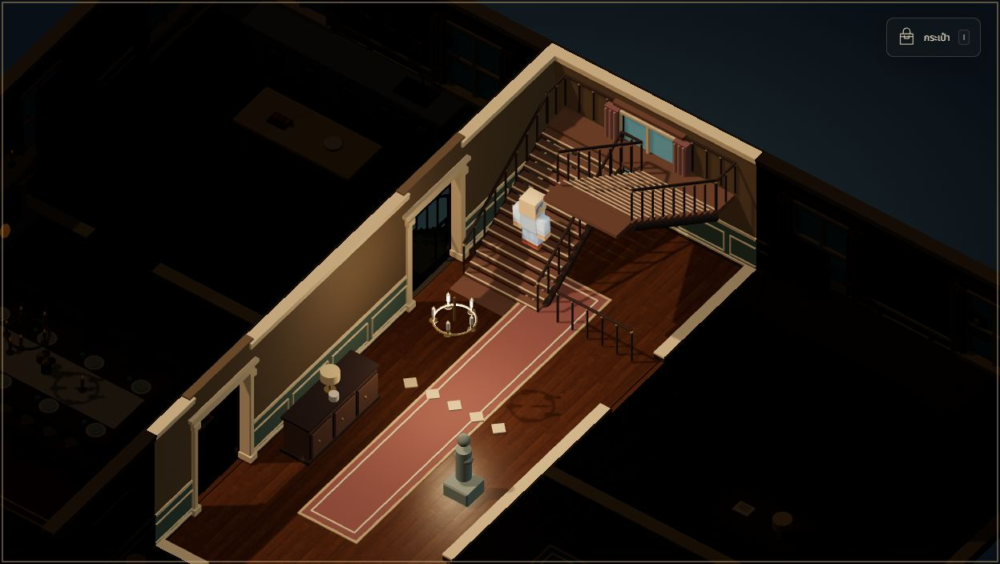
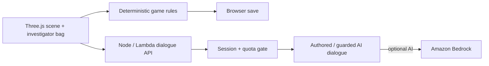

# The Last Dinner

A Thai/English mystery game about a house that remembers, and people who remember differently.

**[Play in your browser](https://d3imrhbpvqr1t2.cloudfront.net/)** · [Controls](docs/CONTROLS.md) · [Mansion design](docs/MANSION-DESIGN.md)

A key, a list of names, and an anonymous tape bring an investigator to a mansion on its last night before sale. Six residents carry fragments of the same dinner. Enter their memories, compare testimony with physical evidence, and decide what the truth demands of you.



## The game

- Explore a theatrical cutaway house: **3 floors, 14 rooms**, physical staircases, and a hidden chamber.
- Meet **6 residents** following authored routines, and revisit **6 memories** with observation puzzles.
- Collect **14 pieces of evidence**, reconstruct the evening, and reach **3 endings** shaped by your decisions.
- Play in Thai or English, with camera-relative movement, room darkness, an investigator's bag, graduated hints, and browser saves.

Approach objects and residents to investigate. Present relevant evidence to earn access to a memory; each memory reveals only what its owner witnessed. Use the bag to compare clues and build the case. Wrong puzzle answers are recoverable, and the complete story works with authored dialogue when AI is unavailable.

## Controls

| Action | Keyboard / mouse |
|---|---|
| Move | WASD or arrow keys |
| Run | Hold Shift while moving |
| Crouch / stand | C |
| Inspect / talk nearby | E |
| Investigator's bag | I, B, or Tab |
| Floor plan | M |
| Close a window | Escape |
| Rotate camera | Drag on the scene |
| Zoom / reset camera | Mouse wheel / R |

Walk directly onto stairs to change floors. Movement follows the camera, with walking at 1.8 m/s, running at 3.8 m/s, and crouching at 0.9 m/s. Crouching takes precedence over running. Opening a window clears held movement and temporarily pauses resident routines. Close it, then press movement again to continue. The map shows your position; case notes, evidence, time, settings, hints, and save tools live inside the bag.

Touch controls provide held direction and Run buttons, a Crouch toggle, interaction, and a bag button. Sound starts after a player gesture. Settings offers separate Music/Effects levels and walking/running sound auditions; all puzzles can be completed silently. Low graphics and reduced motion are available. See the [bilingual control guide](docs/CONTROLS.md) for details.

## Run locally

Use **Node.js 22.9+ and npm**:

```sh
git clone https://github.com/RathaTart/the-last-dinner.git
cd the-last-dinner
npm ci
npm run dev
```

Open [localhost:8795](http://127.0.0.1:8795/). The server binds to loopback and uses authored dialogue by default. No account, API key, or AWS configuration is needed to play the full case locally.

```sh
npm test
npm run build
```

The build bundles the browser application and self-hosted assets into `dist/`. Tests cover story progression, save validation, navigation and stairs, held input, movement/audio timing, sound lifecycle, dialogue filtering, quotas, and HTTP behavior. [GitHub CI](.github/workflows/ci.yml) runs locked installation, tests, and build on Node.js 22; it contains no cloud deployment step.

For optional Bedrock dialogue, copy `.env.example` to `.env`, select your existing AWS profile, and set `DIALOGUE_PROVIDER=bedrock`. Credentials use the AWS SDK credential chain and stay outside browser code. Deployment scripts target the project's AWS stack; adapt their configuration before deploying a fork. [Operations](docs/OPERATIONS.md) covers deployment, rollback, and disabling AI.

## AI, canon, and player data

The deployed dialogue service uses Claude Sonnet 4.5 through Amazon Bedrock for conversational flavor. Thai requests classify an approved theme, then return reviewed Thai lines selected against the player's evidence. English requests can generate short replies from the resident's allowed facts and pass through a conservative spoiler filter. Plot-critical questions use authored text.

Game rules own evidence, trust, puzzle answers, and endings. Model output cannot change them. Invalid output, provider failure, timeout, and quota exhaustion return authored dialogue. Generated English can still be inaccurate, and theme classification can be imperfect; the canon filter is a practical guard rather than a semantic guarantee.

The backend stores quota counters, anonymous session identifiers, and HMAC-derived IP identifiers with expiry; it does not store raw questions or conversation text. AI requests send the question and bounded fictional context to Bedrock for processing under AWS terms. Browser saves retain progress and conversations, including typed questions, and can be exported from Settings.

The AI gate reserves at most **24 requests per anonymous session, 80 per IP per UTC day, 200 globally per UTC day, and 2,000 over the release lifetime**. Authored or rejected answers can consume a reservation. Requests are bounded in size, output tokens, and duration; exhaustion keeps the authored game playable.

## Engineering choices



| Area | Decision and purpose |
|---|---|
| House and movement | `mansion-layout.js` supplies visible architecture, doorways, furniture, clue anchors, collision, and stair surfaces so exploration follows the rendered house. |
| Presentation | Three.js renders a stylized cutaway mansion with procedural furnishings, local PBR maps, and licensed character bases. Current-room lighting and camera-facing wall fading keep the investigation readable. |
| Story | `content.js` defines bilingual canon; `game.js` validates progression and saves. Staged memories and evidence gates give every puzzle a reproducible solution. |
| Movement and sound | Shared movement profiles connect speed, stride, and footfall cadence. WebAudio uses bounded voices, mute/visibility cleanup, and short scheduling lookahead. Five cached wood recordings avoid immediate repeats; loading failure uses synthesized contacts. |
| Cloud | Private S3 and CloudFront serve the game; Lambda handles dialogue, DynamoDB reserves quotas atomically, and Bedrock access is scoped by IAM. Cloud credentials never enter the client bundle. |

## Scope and next steps

Version **1.0.0** is the first playable release. The mansion and story are bespoke; character bases are stylized third-party assets, resident routines stay within authored rooms, and memories are scripted observation scenes. Bespoke character art, recorded dialogue, broader device/playtesting, and further visual and accessibility work remain production goals. Desktop keyboard/mouse is the primary interaction design; touch controls need continued testing across devices.

## Credits and license

Original project code is released under the [MIT License](LICENSE), copyright 2026 RathaTart. Third-party assets retain their own licenses:

- [Kenney](https://kenney.nl/): CC0 character/furniture assets and five recorded wooden footsteps from [Impact Sounds](https://kenney.nl/assets/impact-sounds).
- [Poly Haven](https://polyhaven.com/): CC0 wood, plaster, and stone material maps.
- Noto Sans Thai, DM Sans, and Playfair Display: SIL Open Font License.
- [Three.js](https://github.com/mrdoob/three.js): MIT.

The music motif and remaining house effects are original WebAudio synthesis. All runtime assets are self-hosted. The [asset register](docs/ASSETS.md), [manifest](docs/ASSET-MANIFEST.json), and [included license texts](assets/licenses/) document provenance. The cutaway atmosphere takes inspiration from *The Sexy Brutale*; no assets from that game are included.

## Documentation and contributions

[Controls](docs/CONTROLS.md), [mansion design](docs/MANSION-DESIGN.md), [sound design](docs/SOUND-DESIGN.md), and [operations](docs/OPERATIONS.md) cover the playable systems and implementation. The [production plan](PRODUCTION-PLAN.md) records the larger development roadmap.

**Spoilers:** the [complete playthrough](docs/PLAYTHROUGH.md), [story bible and puzzle solutions](docs/STORY-BIBLE.md), and [storyboard](docs/STORYBOARD.md) reveal the case, memories, and endings.

[Bug reports](https://github.com/RathaTart/the-last-dinner/issues) and focused improvements are welcome. Include browser/device details and reproduction steps; for visual changes, include a screenshot. Keep Thai/English content and story rules consistent, preserve third-party notices, and run `npm test` and `npm run build` before opening a pull request.
